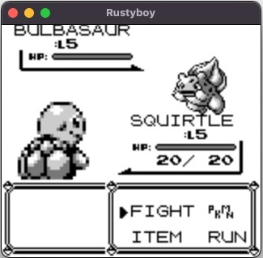
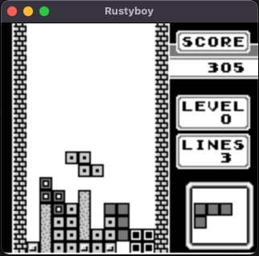
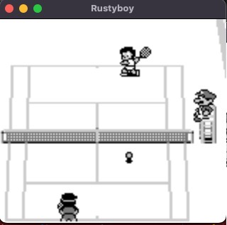

# Rustyboy

A Gameboy emulator written in Rust for didactical purposes.

## Status

This list shows what works and what still needs to be done

- [x] Cpu
- [x] PPU
  - [x] Background
  - [x] Sprites (works but has to be tested more)
  - [x] Window
- [ ] Interrupts
  - [x] VBlank
  - [x] LCD Stat
  - [ ] Joypad
  - [x] Timer
  - [ ] Serial
- [ ] APU
- [ ] MBC
  - [x] No MBC
  - [x] MBC1
  - [ ] MBC2
  - [x] MBC3 (partially supported)
  - [ ] MBC5
  - [ ] MBC6
  - [ ] MBC7
