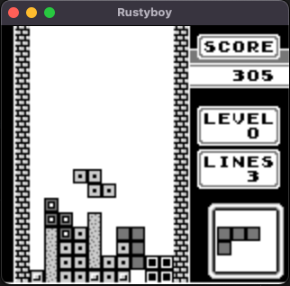

# Rustyboy

A Gameboy emulator written in Rust for didactical purposes.

## Status

This list shows what works and what still needs to be done

- [x] Cpu (mostly, I still sometimes find bugs on some instructions)
- [ ] PPU
  - [x] Background (it works, but not the map shifting)
  - [x] Sprites (works but has to be tested more)
  - [ ] Window
- [ ] Interrupts
  - [x] VBlank
  - [ ] LCD Stat
  - [ ] Joypad
  - [ ] Timer
  - [ ] Serial
- [ ] APU
